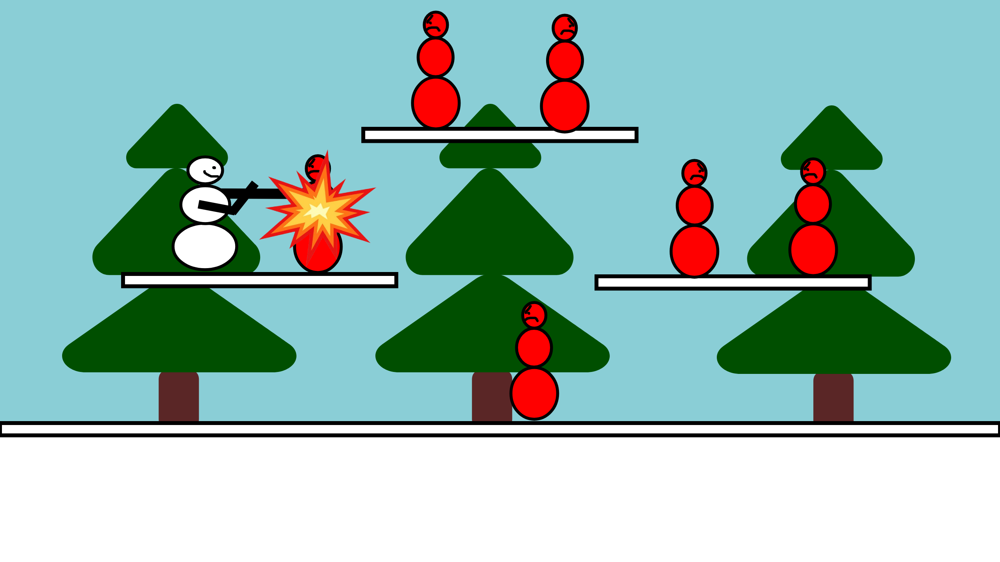

# Harjoitustyön suunnitelma

## Tietoja
**Tekijä:** Seppänen Joonas

**Työ git-varaston osoite:** https://github.com/j-studens/ohj1ht.git

**Pelin nimi:** Lumiukko Fighter

**Pelialusta:** Windows11

**Pelaajien lukumäärä:** 1

## Pelin tarina
Olet Jere Lumiukko. Asut Rovanniemellä Pajakylässä muiden lumiukkojen kanssa. Joulupukki päätti yhtäkkiä valloittaa maailman. Hän lähetti sotajoukonsa, jotka koostuvat ilkeistä lumiukoista, valoittamaan Pajakylää, jolla on erittäin iso strateginen merkitys. Puolusta Pajakylää ilkeiltä lumiukoilta ja kukista Joulupukki itse.

## Pelin idea ja tavoitteet
### Tavoite
Torju 100 ilkeätä lumiukko sotilasta, minkä jälkeen kukista Joulupukki.
### Idea
Pelaajan hahmo, Jere Lumiukko, pomppii 2D-alustalla ja tappelee lumiukko sotilaita vastaan. Lumiukko sotilaat joko lähestyvät pelaajan hahmoa tai pysyvät paikallaan. Pelaajan tavoite on kuitenkin torjua ne nyrkkeilemällä. 

## Hahmotelma pelistä

## Toteutuksen suunnitelma
### Helmikuu
Tavoite 1 - Suunnitelma.
Tavoite 2 - Etävaraston luominen.
Tavoite 3 - Koodipätkien tekeminen.

### Maaliskuu

Tavoite 1 - Ohjaimet (WASD, Space)
Tavoite 2 - Pelaajahahmo & lumiukko viholliset
Tavoite 3 - Joulupukin koodaaminen

### Jos aikaa jää

Tavoite 1 - Huippusalainen taso, joka avautuu pelin lopussa
Tavoite 2 - Pistemäärä

Tavoite 3 - Paremmat grafiikat
